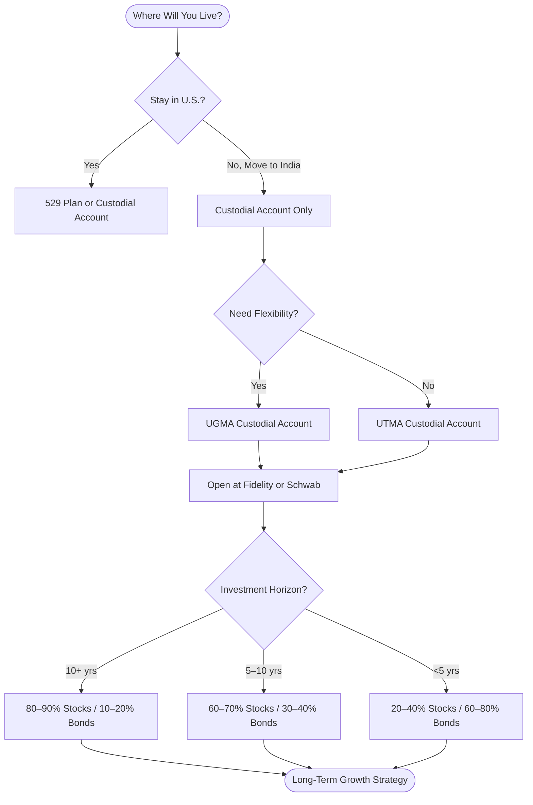

# Lifecycle Flowchart

```mermaid
flowchart LR
    A([Start: Decide to Invest for Child]) --> B[Choose UGMA/UTMA]
    B --> C[Select Provider: Fidelity or Schwab]
    C --> D[Gather Documents<br/>IDs, SSNs, Address]
    D --> E[Open Account Online]
    E --> F[Fund via U.S. Bank]
    F --> G[Invest in ETFs / Index Funds]
    G --> H[Manage & Rebalance Over Years]

    H --> I{Move Abroad?}
    I -->|Yes| J[Maintain U.S. Address & Bank]
    J --> K[Continue Investing from Abroad]
    K --> L[Withdraw Only for Child's Benefit]

    L --> M[Child Reaches Majority Age 18–25]
    M --> N[Transfer Ownership Online from Abroad]
    N --> O([Child Chooses: Keep Investing or Withdraw])
```

```mermaid
flowchart TD
    A([Where Will You Live?]) --> B{Stay in U.S.?}
    B -->|Yes| C[529 Plan or Custodial Account]
    B -->|No, Move to India| D[Custodial Account Only]

    D --> E{Need Flexibility?}
    E -->|Yes| F[UGMA Custodial Account]
    E -->|No| G[UTMA Custodial Account]

    F --> H[Open at Fidelity or Schwab]
    G --> H

    H --> I{Investment Horizon?}
    I -->|10+ yrs| J[80–90&percnt; Stocks / 10–20&percnt; Bonds]
    I -->|5–10 yrs| K[60–70&percnt; Stocks / 30–40&percnt; Bonds]
    I -->|<5 yrs| L[20–40&percnt; Stocks / 60–80&percnt; Bonds]

    J --> M([Long-Term Growth Strategy])
    K --> M
    L --> M

```
---

*Disclaimer: Not financial or tax advice.*